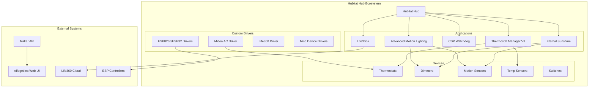
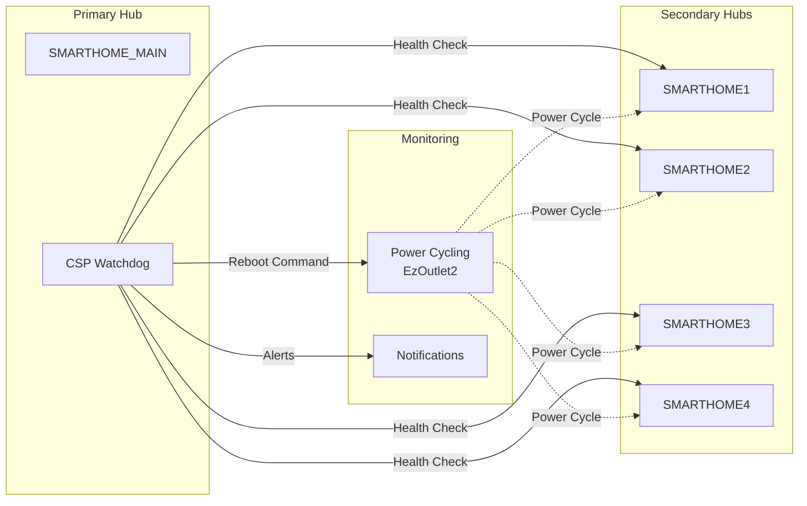
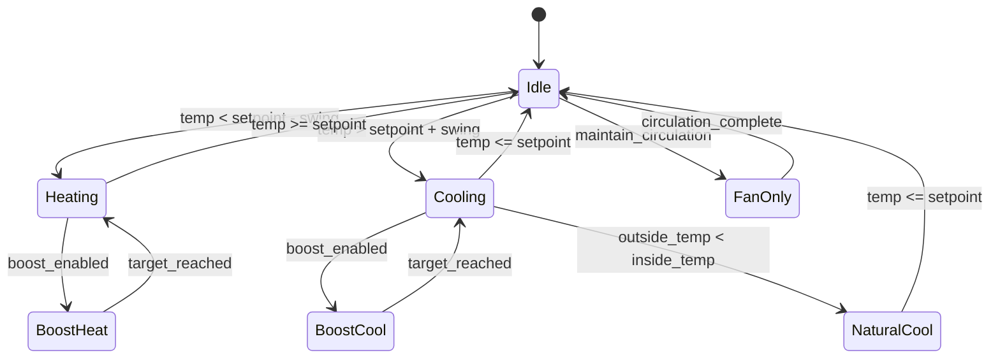
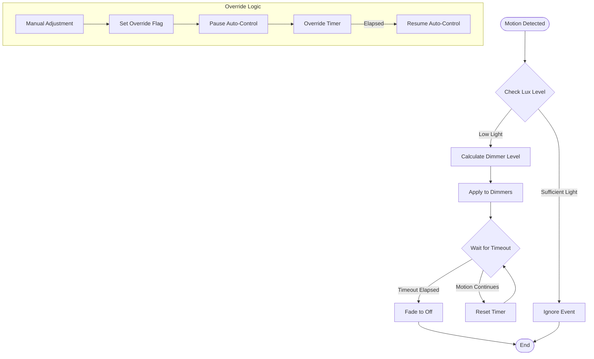
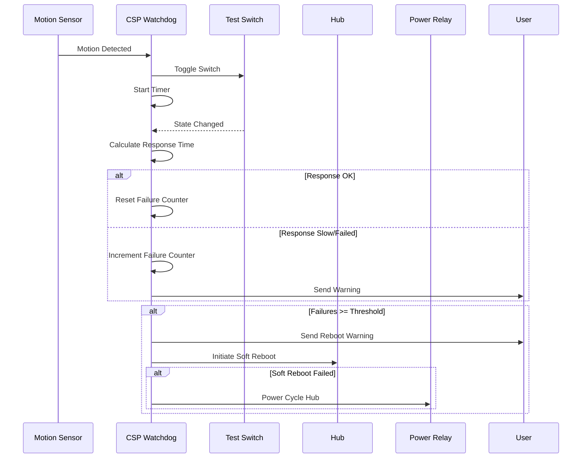
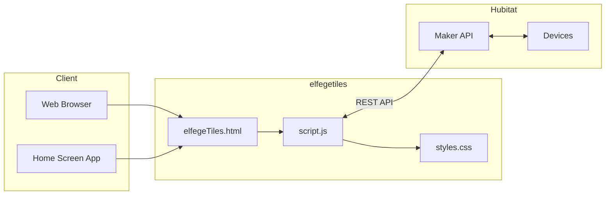

# Hubitat Smart Home Automation Suite

A comprehensive collection of custom Hubitat Elevation apps and drivers for advanced home automation. This repository showcases production-grade Groovy development with intelligent climate control, motion-based lighting, hub health monitoring, and custom device integrations.

## Table of Contents

- [Overview](#overview)
- [Architecture](#architecture)
- [Applications](#applications)
  - [Climate Control](#climate-control)
  - [Lighting Automation](#lighting-automation)
  - [Hub Health Monitoring](#hub-health-monitoring)
  - [Power Management](#power-management)
  - [Presence Detection](#presence-detection)
- [Custom Drivers](#custom-drivers)
- [Web Interface](#web-interface)
- [Installation](#installation)
- [Repository Structure](#repository-structure)
- [License](#license)

## Overview

This suite provides enterprise-level automation capabilities for Hubitat Elevation hubs, featuring:

- **Intelligent Climate Management** with multi-thermostat coordination and boost heating/cooling
- **Adaptive Lighting** that responds to illuminance levels and motion
- **Multi-Hub Monitoring** with automatic health checks and remote reboot capabilities
- **Custom Device Drivers** for ESP8266/ESP32 controllers, Midea AC units, and more
- **Web-Based Dashboard** for real-time device control via Maker API



## Architecture

### Multi-Hub Deployment

The system supports multiple Hubitat hubs with centralized monitoring and cross-hub communication.



## Applications

### Climate Control

#### Thermostat Manager V3

An advanced thermostat management system with intelligent temperature control, motion-based occupancy detection, and energy optimization.

**Key Features:**

- Multi-thermostat coordination with unified control
- Boost mode for rapid heating/cooling
- Motion sensor integration for occupancy-based control
- Outside temperature awareness for natural cooling optimization
- Virtual thermostat controller for centralized management
- Fan circulation mode to prevent mold formation



**Location:** [SMARTHOME_MAIN/APPS/CLIMATE/TEMPERATURE/Thermostat-Manager/](SMARTHOME_MAIN/APPS/CLIMATE/TEMPERATURE/Thermostat-Manager/)

#### Midea AC Integration

Local LAN control for Midea-branded air conditioners, eliminating cloud dependency.

**Features:**

- Direct device communication via msmart-ng protocol
- Real-time temperature and status updates
- Full HVAC mode control (heat, cool, auto, fan, dry)
- Fan speed and swing control

**Location:** [SMARTHOME_MAIN/APPS/CLIMATE/TEMPERATURE/hubitat_midea/](SMARTHOME_MAIN/APPS/CLIMATE/TEMPERATURE/hubitat_midea/)

---

### Lighting Automation

#### Eternal Sunshine

Luminescence-based dimmer control that automatically adjusts lighting based on ambient light levels and motion.

**Key Features:**

- Lux sensor integration with adaptive learning
- Motion sensor timeout management
- Override capability with configurable duration
- Multi-dimmer coordination
- Mode-based restrictions
- Presence-based pause/resume



**Location:** [SMARTHOME_MAIN/APPS/LIGHTING/eternalSunshine/](SMARTHOME_MAIN/APPS/LIGHTING/eternalSunshine/)

#### Advanced Motion Lighting Management V2

Comprehensive motion-based lighting control with mode-specific behavior and multi-sensor support.

**Features:**

- Mode-specific dimming levels
- RGB color control support
- Button-based app pausing
- Illuminance-based decision making
- Contact sensor integration
- Watchdog monitoring

**Location:** [SMARTHOME_MAIN/APPS/LIGHTING/Advanced-Motion-Light-Management/](SMARTHOME_MAIN/APPS/LIGHTING/Advanced-Motion-Light-Management/)

---

### Hub Health Monitoring

#### CSP Watchdog V2

A robust hub health monitoring system that tracks responsiveness, detects issues, and can automatically reboot hubs when problems are detected.

**Key Features:**

- Real-time hub health assessment
- Response time testing via motion sensors and switches
- CPU load, radio, and cloud connectivity monitoring
- Multi-hub remote monitoring
- Automatic reboot with configurable cooldown
- HTTP relay support for hard power cycling
- Notification alerts via speakers and push notifications



**Location:** [SMARTHOME_MAIN/APPS/WATCHDOG/](SMARTHOME_MAIN/APPS/WATCHDOG/)

---

### Power Management

#### Battery Level Notification

Monitors device battery levels and sends alerts when batteries are low.

**Location:** [SMARTHOME_MAIN/APPS/BATTERY_MANAGEMENT/](SMARTHOME_MAIN/APPS/BATTERY_MANAGEMENT/)

#### Computer Sleep Manager

Monitors PC activity and manages power states.

#### Power Consumption Monitor

Real-time power usage tracking and reporting.

**Location:** [SMARTHOME_MAIN/APPS/POWER/](SMARTHOME_MAIN/APPS/POWER/)

---

### Presence Detection

#### Life360+

Enhanced Life360 integration for family location tracking with Hubitat presence management.

**Features:**

- Real-time location tracking
- Arrival/departure detection
- Distance and boundary triggers
- Sleep state tracking
- Auto-adjusting refresh rates based on movement

**Location:** [SMARTHOME_MAIN/APPS/GEOLOCATION_PRESENCE/](SMARTHOME_MAIN/APPS/GEOLOCATION_PRESENCE/)

---

## Custom Drivers

| Driver | Description | Communication |
| ------ | ----------- | ------------- |
| **ESP8266 Curtains** | Motorized curtain/blind control | HTTP/REST |
| **ESP8266 Door Intercom** | Video intercom integration | HTTP/REST |
| **ESP8266 Apple TV/IR** | IR control for entertainment devices | HTTP/REST |
| **Midea AC Controller** | Local control for Midea HVAC | LAN Protocol |
| **Life360+ Driver** | Location tracker user driver | Cloud API |
| **Gas Detector** | Gas leak sensor | Zigbee/Z-Wave |
| **PIR Motion Sensor** | Custom motion sensor handler | Zigbee/Z-Wave |
| **Cats Water Tank** | Pet water level monitor | HTTP/REST |
| **EzOutlet2** | Network power switch control | HTTP/REST |
| **Levoit Air Purifier** | Core 400S/600S control | Cloud API |

**Location:** [SMARTHOME_MAIN/DRIVERS/](SMARTHOME_MAIN/DRIVERS/)

---

## Web Interface

### elfegetiles

A responsive web-based dashboard for device control via Hubitat's Maker API.



**Features:**

- Real-time device status
- Touch-friendly tile interface
- Mobile-optimized design
- Home screen webapp support (iOS/Android)

**Location:** [SMARTHOME_MAIN/APPS/MISC/elfegetiles/](SMARTHOME_MAIN/APPS/MISC/elfegetiles/)

---

## Installation

### Prerequisites

- Hubitat Elevation hub (C-5, C-7, or C-8)
- Hubitat Package Manager (recommended)

### Manual Installation

1. **Apps:**
   - Navigate to Hubitat's "Apps Code" section
   - Click "New App"
   - Paste the Groovy code from the desired app
   - Click "Save"
   - Go to "Apps" > "Add User App" to install

2. **Drivers:**
   - Navigate to Hubitat's "Drivers Code" section
   - Click "New Driver"
   - Paste the Groovy code from the desired driver
   - Click "Save"
   - Assign to devices via "Devices" > device > "Type"

### Midea AC Setup

For Midea air conditioner integration, additional Python setup is required:

```bash
cd SMARTHOME_MAIN/APPS/CLIMATE/TEMPERATURE/midea-msmart
pip install -e .
python discover_devices.py  # Find your AC units
```

---

## Repository Structure

```text
HUBITAT/
├── SMARTHOME_MAIN/              # Primary hub configuration
│   ├── APPS/
│   │   ├── BATTERY_MANAGEMENT/  # Battery monitoring
│   │   ├── CLIMATE/             # Temperature & humidity control
│   │   │   ├── HUMIDITY/
│   │   │   └── TEMPERATURE/
│   │   │       ├── Thermostat-Manager/
│   │   │       ├── hubitat_midea/
│   │   │       └── midea-msmart/
│   │   ├── GEOLOCATION_PRESENCE/# Life360 integration
│   │   ├── LIGHTING/            # Light automation
│   │   │   ├── eternalSunshine/
│   │   │   └── Advanced-Motion-Light-Management/
│   │   ├── MISC/                # Utilities & web UI
│   │   │   └── elfegetiles/
│   │   ├── POWER/               # Power monitoring
│   │   └── WATCHDOG/            # Hub health monitoring
│   └── DRIVERS/                 # Custom device drivers
├── SMARTHOME1-4/                # Additional hub configs
├── HOOKS.md                     # Git hook documentation
└── README.md                    # This file
```

---

## Technology Stack

- **Primary Language:** Groovy (Hubitat DSL)
- **Web Interface:** HTML5, CSS3, JavaScript
- **Python:** Midea AC integration (msmart-ng)
- **Protocols:** Z-Wave, Zigbee, HTTP/REST, MQTT
- **Version Control:** Git with custom pre-commit hooks

---

## Author

Elfege Leylavergne

---

## License

Individual apps and drivers may have different licenses. See the license headers in each file for details.

- **Thermostat Manager V3:** Non-Commercial Use Only
- **Eternal Sunshine:** AS-IS, Copyright 2016
- **Life360+ Driver:** Apache License 2.0

---

## Contributing

Contributions are welcome! Please ensure any submissions:

- Follow existing code style and patterns
- Include appropriate documentation
- Have been tested on Hubitat Elevation

---

## Acknowledgments

- Hubitat Community for platform support
- bptworld for Life360 driver foundation
- msmart-ng contributors for Midea protocol research
